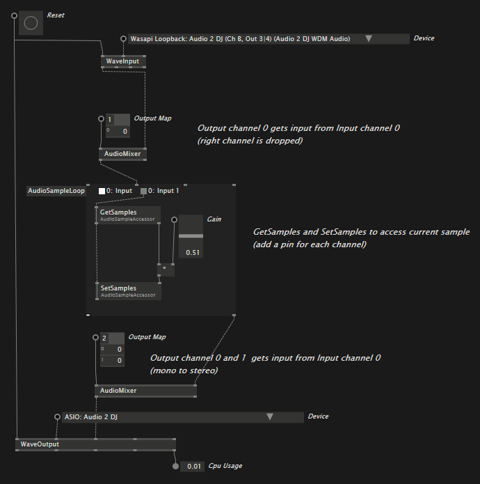

### VL.NewAudio

Implementation of a modular audio engine for [VL](https://vvvv.org/documentation/vl) written from scratch.

There are a few important VL Nodes:

#### WaveInput

Any Windows sound input or capture device (WaveIn, Wasapi, Wasapi Loopback or ASIO). Outputs a fresh AudioSampleBuffer, that can be used later.

#### WaveOutput

Any Windows sound output device (WaveOut, DirectSound, Wasapi or ASIO). Takes an AudioSampleBuffer and sends data to sound driver.

* WaveOut: Do not use this, its freaking slow!
* DirectSound, nah
* Wasapi: This gives good performance and work with low latency (~45m)
* ASIO: Use this if possible, latency is below 20ms

#### AudioMixer

AudioSampleBuffers may use any number of channels (most commonly, 2 channels for stereo).

To mix multiple AudioSampleBuffers into exactly one output Buffer, you can use the AudioMixer.
Takes a Spread of AudioSampleBuffers (with any number of channels) and a Spread of Integers, to map input to output channels.

#### AudioSampleLoop

A custom region, that loops over an AudioSampleBuffer in the sound render thread.

Inputs per iteration are:
* 0-InBuffer: Reference to the input AudioSampleBuffer (float[])
* 1-InIndex: Position in the input buffer for the current iteration
* 2-OutBuffer: Reference to the output AudioSampleBuffer (float[])
* 3-OutIndex: Position in the output buffer for the current iteration

To access the sample(s) for the current iteration, you may use Get/SetSample.

If you want to use any time related VL Nodes, connect the supplied clock to your nodes. This clock ticks on sample base.

#### Get/SetSample

Small helper to access a single sample. Only useful inside an AudioSampleLoop.

* GetSample needs the InBuffer, InIndex and the channel to read from
* SetSample needs the OutBuffer, OutIndex and the channel to write to

#### VCV

For some advance examples, check out the NewAudio.CV example.

