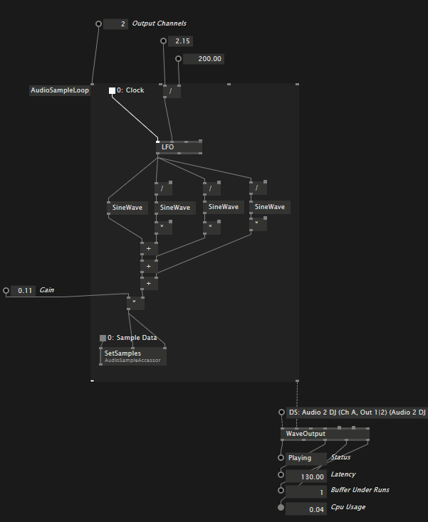
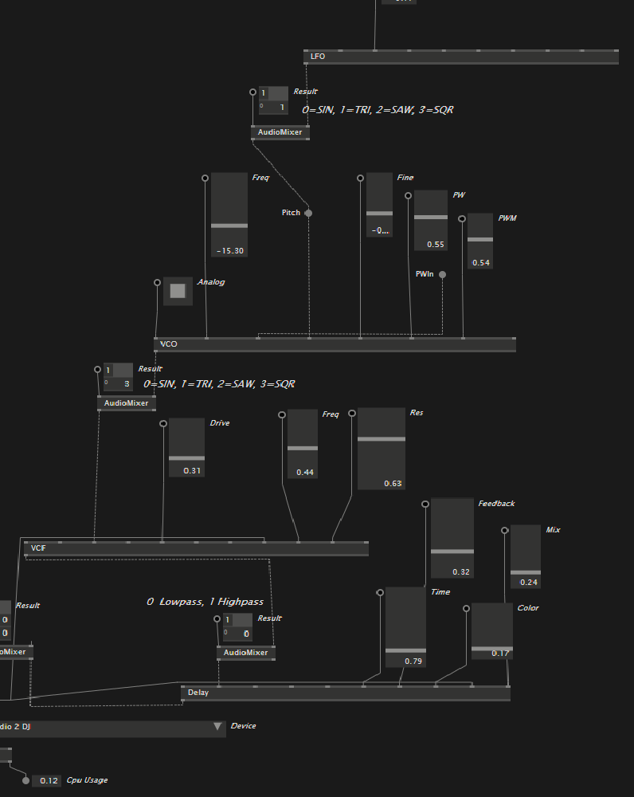

### VL.NewAudio

Implementation of a modular audio engine for [VL](https://vvvv.org/documentation/vl) written from scratch.

There are a few important VL Nodes:

#### WaveInput

Any Windows sound input or capture device (WaveIn, Wasapi, Wasapi Loopback or ASIO). Outputs an AudioLink, that is used to send sample buffers between VL.NewAudio nodes.

#### WaveOutput

Any Windows sound output device (WaveOut, DirectSound, Wasapi or ASIO). Takes an AudioLink as input and send its samples to the sound card driver.

* WaveOut: Do not use this, its freaking slow!
* DirectSound, nah
* Wasapi: This gives good performance and work with low latency (~45m)
* Use Wasapi Loopback to capture sound from other Windows applications
* ASIO: Use this if possible, latency is below 20ms

#### AudioLink and AudioMessage

A AudioLink works like a normal VL patch connection. However, it is used to send different kinds of data, all implementing a common interface IAudioMessage.

Sound data itself can be transmitted either in normal sound format (ch0, ch1, ch2, ch0, ch1, ...). It is also possible to convert the data in to seperated 
channels. This makes working with multichannel sounds much easier.

#### AudioLoopRegion

A custom region, that loops over each sample in an audio message.

In each iteration you have access to an AudioChannels node, which can be used to get all or individual samples from the raw data.

If you want to use any time related VL Nodes, connect the supplied clock to your nodes. This clock ticks on sample base.

#### FFT

Provides FFT data as complex, normalized numbers (so you get two channels out). The IFFT takes complex number stream back and calculates
the real numbers (2ch=>1ch).

### 

